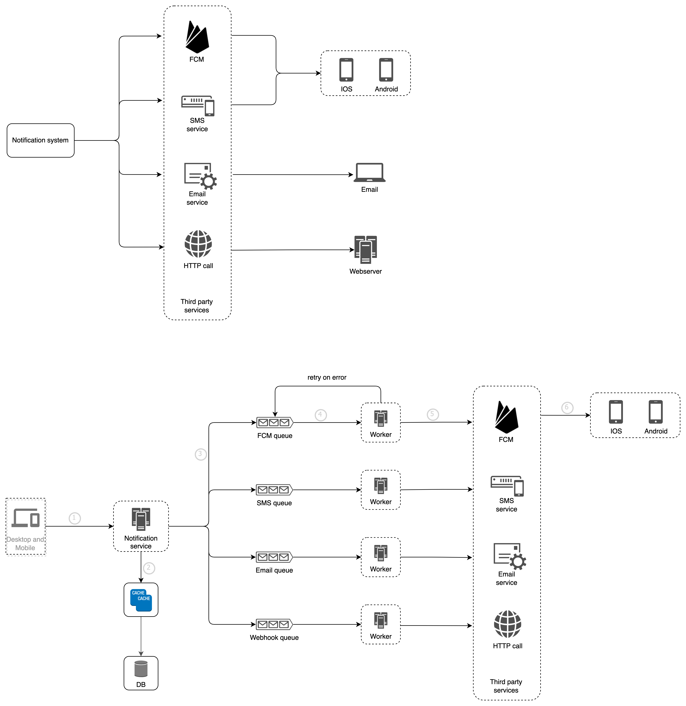

# Notification system design

Build notification system with laravel framework. This system will be implemented using redis, memcached for the cache, mailhog for our mail server and pgsql for the database

## How to run
First, you have to configure your `.env` file, following the example below. The host name must contain the name of the service configured in the `docker-compose.yml` file.
The docker management service used is [Laravel sail](https://laravel.com/docs/9.x/sail)

### Cache and Queue
```dotenv
QUEUE_CONNECTION=redis
CACHE_DRIVER=memcached
```

### Redis

```dotenv
REDIS_HOST=redis
REDIS_PASSWORD=null
REDIS_PORT=6379
```

### Memcached

```dotenv
MEMCACHED_HOST=memcached
```

### PostgresSQL

```dotenv
DB_CONNECTION=pgsql
DB_HOST=pgsql
DB_PORT=5432
DB_DATABASE=laravel_notification_system
DB_USERNAME=homestead
DB_PASSWORD=homestead
```

### Mailhog

```dotenv
MAIL_MAILER=smtp
MAIL_HOST=mailhog
MAIL_PORT=1025
MAIL_USERNAME=null
MAIL_PASSWORD=null
MAIL_ENCRYPTION=null
MAIL_FROM_ADDRESS="hello@example.com"
MAIL_FROM_NAME="${APP_NAME}"
```

## Job queue
Laravel allows to generate jobs, while taking into account the queue system. So, we will not set up a service from scratch, we will simply use the one provided by Laravel.

## Notification
Although Laravel has a notification system, we are not going to use it here, the idea is to show you how to set up a good system simply with the `design pattern`, so you could reproduce it more easily with any programming language of your choice.

## Architecture design
Our system must be able to send notifications via SMS, push, email and webhook.


